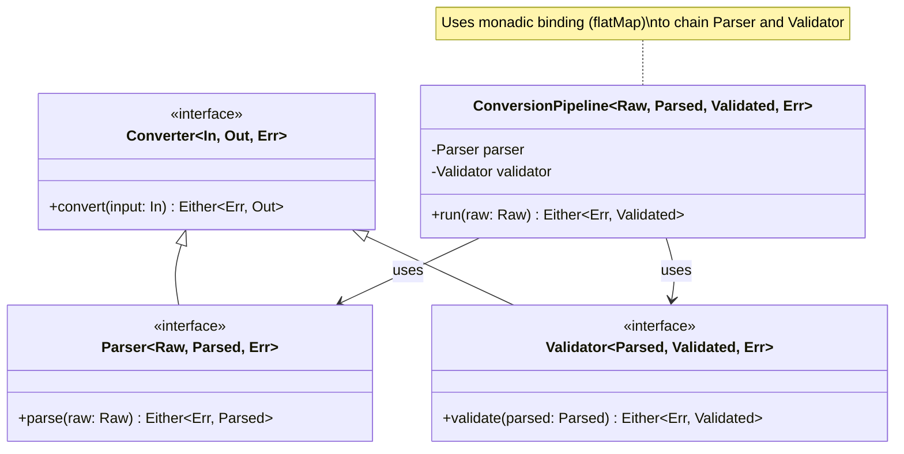
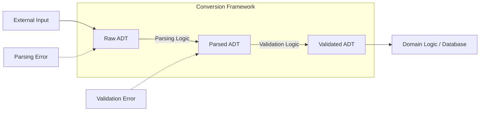

# Converter Framework: Raw / Parsed / Validated ADT Approach

## Overview
This framework provides a robust way to handle complex type conversions using an Algebraic Data Type (ADT) approach. By separating the data into three distinct states—**Raw**, **Parsed**, and **Validated**—we ensure a clear pipeline for data processing, error handling, and type safety.

In contexts like **Apache Spark**, converting complex types often involves manipulating composite structures such as `ArrayType`, `MapType`, and `StructType`. This framework facilitates these transformations by providing a structured path to flatten, map, and validate these entities before they reach your core domain logic or data warehouse.

## Core Conversion Strategies

### 1. Handling Collections (Arrays)
When dealing with `ArrayType`, the framework handles the transition from a collection of raw inputs to a collection of validated domain objects.
- **Explosion/Flattening**: During the **Parsing** stage, raw arrays can be exploded into individual records or mapped into structured lists within the **Parsed ADT**.
- **Transformation**: Each element undergoes its own Raw -> Parsed -> Validated lifecycle.

### 2. Nested Records (Structs)
Nested `StructType` data is mapped to nested Case Classes.
- **Raw**: Often represented as a `Map[String, Any]` or a nested JSON-like structure.
- **Parsed**: Mapped to a structural Case Class where nested fields are typed (e.g., `Option[String]`, `Int`).
- **Validated**: Mapped to the final Domain Model with deep validation of nested constraints.

### 3. Maps and Key-Value Pairs
`MapType` data is transformed by validating both keys and values.
- **Raw**: `Map[String, String]` (e.g., tags or properties).
- **Parsed**: `Map[String, Int]` (e.g., counts or IDs).
- **Validated**: A typed collection or a specific domain entity if the keys represent known properties.

## Architecture

The conversion process follows a linear pipeline:

1.  **Raw State**: The initial data format (e.g., JSON, CSV, String, Map). It represents data that has entered the system but hasn't been processed yet.
2.  **Parsed State**: Data that has been structurally verified and mapped to a preliminary internal representation (e.g., Case Classes with primitive types). At this stage, we know the types are correct, but the domain rules (business logic) haven't been applied.
3.  **Validated State**: The final, domain-rich representation. This state ensures that all business constraints (e.g., "age must be positive", "email must be valid") are met.

### System Design (UML-like Diagram)



### Core Contracts (The Design)

The framework is built upon three primary contracts defined as Scala traits:

#### 1. The Base Converter
```scala
trait Converter[In, Out] {
  type Error
  def convert(input: In): Either[List[Error], Out]
}
```

#### 2. The Parser (Structural Contract)
Responsible for type safety and structural integrity.
```scala
trait Parser[Raw, Parsed] extends Converter[Raw, Parsed] {
  // Implementation focuses on mapping types (e.g., String -> Int)
  // and flattening complex structures (Arrays, Maps).
}
```

#### 3. The Validator (Domain Contract)
Responsible for business logic and data consistency.
```scala
trait Validator[Parsed, Validated] extends Converter[Parsed, Validated] {
  // Implementation focuses on domain constraints (e.g., age >= 18).
}
```

### Flow Diagram



## ADT Definitions

### 1. Raw
Represents the data in its most primitive form. It often uses generic types or simple maps to hold unverified input.

### 2. Parsed
A structured representation of the raw data. It handles type conversions (e.g., String to Int, String to Date). If parsing fails, it accumulates errors.

### 3. Validated
The high-integrity domain model. It uses refined types or smart constructors to guarantee that the data is not only structurally sound but also logically valid.

## Core Components

-   **Converter[In, Out]**: A trait that defines the transformation between states.
-   **Parser[Raw, Parsed]**: Specifically handles the transition from Raw to Parsed.
-   **Validator[Parsed, Validated]**: Handles the transition from Parsed to Validated.
-   **Error Handling**: Uses `Either`, `Validated` (from Cats), or a custom `ConversionResult` to accumulate multiple errors during both parsing and validation phases.

## Example Scenario: User Registration

### 1. Raw Data (Input)
Typically, data arrives from an untrusted source as a simple collection, a string, or a Spark `Row`.
```scala
// Representing a Spark Row with complex types
val rawInput = Map(
  "username" -> "john_doe",
  "age"      -> "25",
  "email"    -> "john@example.com",
  "tags"     -> List("scala", "spark", "adt"), // ArrayType
  "metadata" -> Map("priority" -> "high")      // MapType
)
```

### 2. Parsed ADT
The first transformation attempts to map types correctly and handle structural conversion of complex types.
```scala
case class UserParsed(
  username: String,
  age: Int,
  email: String,
  tags: List[String],
  priority: String
)

// Output after Parsing:
// Right(UserParsed("john_doe", 25, "john@example.com", List("scala", "spark"), "high"))
```

### 3. Validated ADT (Final Output)
The final transformation applies business constraints.
```scala
case class Username(value: String) // Must be non-empty
case class Age(value: Int)           // Must be >= 18
case class Email(value: String)      // Must contain '@'

case class User(
  username: Username,
  age: Age,
  email: Email
)

// Output after Validation:
// Right(User(Username("john_doe"), Age(25), Email("john@example.com")))
// OR
// Left(List("Age must be at least 18", "Email is invalid"))
```

## Practical Implementation Example

```scala
// Transformation Pipeline
val result: Either[List[String], User] = for {
  parsed    <- UserParser.parse(rawInput)    // Raw -> Parsed
  validated <- UserValidator.validate(parsed) // Parsed -> Validated
} yield validated
```

## Benefits
-   **Separation of Concerns**: Parsing (structure) is decoupled from Validation (logic).
-   **Error Accumulation**: Collect all errors at once instead of failing fast.
-   **Type Safety**: Ensures that domain logic only operates on fully validated data.
-   **Testability**: Each stage of the pipeline can be tested in isolation.
