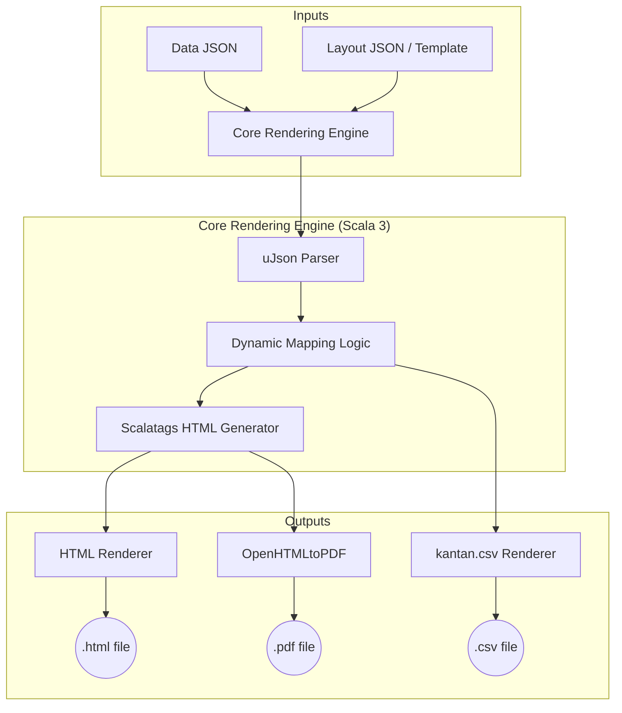

# Template Render Plan

Plan for building a multi-format template renderer (HTML, PDF, CSV) in Scala 3.

## Objective
Implement a system where a single data source can be rendered into multiple formats (HTML, PDF, CSV) using templates.

## 1. Architecture Overview

The system follows a dynamic, configuration-driven architecture where the report structure is decoupled from the application logic.

### 1.1 Architecture Diagram


- **Core Engine**: A Scala service that orchestrates the parsing and rendering process.
- **Data Model**: Case classes representing the data (deserialized via uPickle).
- **Renderers**:
    - `HtmlRenderer`: Generates dynamic HTML based on the Layout JSON.
    - `PdfRenderer`: Converts the generated HTML to PDF.
    - `CsvRenderer`: Maps Data JSON fields to CSV columns using the Layout configuration.

## 2. Proposed Technology Stack
- **JSON Engine**: [uPickle/uJson](https://com-lihaoyi.github.io/upickle/) for high-performance JSON parsing and manipulation.
- **HTML/Template Logic**: [Scalatags](https://github.com/lihaoyi/scalatags) (used internally to convert JSON data to HTML).
- **PDF Generation**: [OpenHTMLtoPDF](https://github.com/danfickle/openhtmltopdf).
- **CSV Generation**: [kantan.csv](https://nrinaudo.github.io/kantan.csv/).

### Detailed Analysis of Technology Stack

#### 1. uPickle/uJson (JSON Template Input)
*   **Advantages:**
    *   **Direct Manipulation:** `uJson` allows navigating and transforming JSON without needing to define case classes immediately (schemaless).
    *   **Fast & Lightweight:** Zero-dependency JSON library that is extremely fast in Scala 3.
    *   **Toolkit Standard:** Part of the official Scala Toolkit, ensuring long-term support.
*   **Drawbacks:**
    *   **Manual Mapping:** Requires writing explicit logic to map JSON keys to the HTML/CSV structures if not using case class auto-derivation.

#### 2. Scalatags (JSON to HTML/PDF)
*   **Advantages:**
    *   **Dynamic Generation:** Perfect for taking a JSON array and mapping it directly to HTML `tr` and `td` tags.
    *   **Type-Safe CSS:** Allows defining styles within the Scala code that are then rendered into the HTML used by the PDF engine.
*   **Drawbacks:**
    *   **Logic in Code:** The "template" remains in the Scala code, meaning changes to the layout require a recompile.

#### 3. OpenHTMLtoPDF & kantan.csv
*(Same as previous analysis - focus on converting the structured data derived from JSON into final artifacts).*

## 3. Dynamic Rendering Architecture

To make the conversion dynamic, the system uses two JSON inputs:
1.  **Data JSON**: The actual content to be rendered.
2.  **Layout JSON (The Template)**: Defines the mapping, columns, and visual hierarchy without requiring code changes for new report types.

### 3.1. Sample Layout JSON (The Dynamic Template)
This JSON defines *how* to render the data. It specifies headers and which keys from the Data JSON to extract.

```json
{
  "reportName": "audit_report",
  "elements": [
    { "type": "header", "sourceKey": "title" },
    { 
      "type": "table", 
      "collectionKey": "items",
      "columns": [
        { "header": "ID", "key": "id" },
        { "header": "Product Name", "key": "desc" },
        { "header": "Price", "key": "price" }
      ]
    }
  ]
}
```

### 3.2. Sample Data JSON (The Content)
```json
{
  "title": "System Audit 2024",
  "items": [
    { "id": "A1", "desc": "Server", "price": 500 },
    { "id": "B2", "desc": "Storage", "price": 200 }
  ]
}
```

### 3.3. Dynamic Engine Logic (Pseudocode)
The engine iterates through the `elements` in the Layout JSON and dynamically pulls values from the Data JSON.

```scala
def renderDynamic(layout: ujson.Value, data: ujson.Value): String = {
  layout("elements").arr.map { element =>
    element("type").str match {
      case "header" => h1(data(element("sourceKey").str).str)
      case "table"  => 
        table(
          tr(element("columns").arr.map(c => th(c("header").str))),
          data(element("collectionKey").str).arr.map { row =>
            tr(element("columns").arr.map(c => td(row(c("key").str).toString)))
          }
        )
    }
  }.mkString
}
```

## 4. Implementation Steps

### Phase 1: Setup & Data Model
- Add necessary dependencies to `build.sbt`.
- Define the domain models (e.g., `ReportData`, `Item`).

### Phase 2: HTML Rendering
- Implement `HtmlRenderer`.
- Define a base HTML template that can be styled via CSS.
- Ensure the output is valid XHTML (required for many PDF converters).

### Phase 3: PDF Rendering
- Implement `PdfRenderer`.
- Use the output from `HtmlRenderer` as input for the PDF engine.
- Configure fonts and page layout (A4, Margins).

### Phase 4: CSV Rendering
- Implement `CsvRenderer`.
- Map the domain models to CSV columns.
- Ensure proper escaping of special characters.

### Phase 5: Unified API
- Create a `TemplateService` that takes a `Format` enum and returns the rendered bytes/string.

## 4. Expected Project Structure
```text
src/main/scala/com/tetokeguii/templaterender/
├── Main.scala
├── models/
│   └── ReportData.scala
├── core/
│   ├── Renderer.scala
│   └── TemplateService.scala
└── renderers/
    ├── HtmlRenderer.scala
    ├── PdfRenderer.scala
    └── CsvRenderer.scala
```

## 5. Verification
- Unit tests for each renderer.
- Integration test to verify that the same `ReportData` produces consistent output across all formats.
